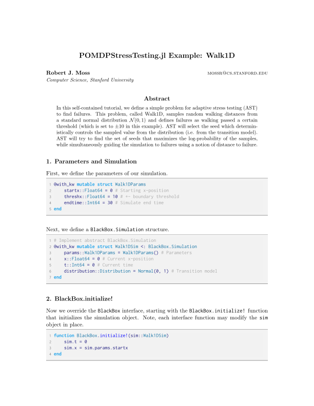

# POMDPStressTesting.jl

[](https://travis-ci.org/sisl/POMDPStressTesting.jl) [](https://nbviewer.jupyter.org/github/sisl/POMDPStressTesting.jl/blob/master/notebooks/Walk1D.ipynb) [](https://codecov.io/gh/sisl/POMDPStressTesting.jl)


Adaptive stress testing of black-box systems, implemented within the [POMDPs.jl](https://github.com/JuliaPOMDP/POMDPs.jl) ecosystem.

# Interface
To stress test a new system, the user has to define the `GrayBox` and `BlackBox` interface outlined in [`src/GrayBox.jl`](https://github.com/mossr/POMDPStressTesting.jl/blob/master/src/GrayBox.jl) and [`src/BlackBox.jl`](https://github.com/mossr/POMDPStressTesting.jl/blob/master/src/BlackBox.jl).

### GrayBox Interface
The `GrayBox` simulator and environment interface includes:
* `GrayBox.Simulation` type to hold simulation variables
* `GrayBox.environment(sim::Simulation)` to return the collection of environment distributions
* `GrayBox.transition!(sim::Simulation)` to transition the simulator, returning the log-likelihood

### BlackBox  Interface
The `BlackBox` system interface includes:
* `BlackBox.initialize!(sim::Simulation)` to initialize/reset the system under test
* `BlackBox.evaluate!(sim::Simulation)` to evaluate/execute the system under test
* `BlackBox.distance(sim::Simulation)` to return how close we are to an event
* `BlackBox.isevent(sim::Simulation)` to indicate if a failure event occurred
* `BlackBox.isterminal(sim::Simulation)` to indicate the simulation is in a terminal state

Functions ending with `!` may modify the `Simulation` object in place.


# Solvers
Several solvers are implemented.

#### Reinforcement learning solvers
* [`MCTSPWSolver`](https://github.com/mossr/POMDPStressTesting.jl/blob/master/src/solvers/mcts.jl)

#### Deep reinforcement learning solvers<sup>1</sup>
* [`TRPOSolver`](https://github.com/mossr/POMDPStressTesting.jl/blob/master/src/solvers/drl/trpo.jl)
* [`PPOSolver`](https://github.com/mossr/POMDPStressTesting.jl/blob/master/src/solvers/drl/ppo.jl)

#### Stochastic optimization solvers
* [`CEMSolver`](https://github.com/mossr/POMDPStressTesting.jl/blob/master/src/solvers/cem.jl)

#### Baseline solvers
* [`RandomSearchSolver`](https://github.com/mossr/POMDPStressTesting.jl/blob/master/src/solvers/random_search.jl)


# Example

An example implementation of the AST interface is provided for the Walk1D problem:
* **Julia source**: [`test/Walk1D.jl`](https://github.com/mossr/POMDPStressTesting.jl/blob/master/test/Walk1D.jl)
* **Jupyter notebook**: [`Walk1D.ipynb`](https://nbviewer.jupyter.org/github/sisl/POMDPStressTesting.jl/blob/master/notebooks/Walk1D.ipynb)
* **Descriptive tutorial-style write-up**: [`walk1d.pdf`](./test/pdf/walk1d.pdf) (created using [TeX.jl](https://github.com/mossr/TeX.jl))

<!-- (https://github.com/mossr/POMDPStressTesting.jl/blob/master/test/walk1d.pdf) -->

<kbd>
<p align="center">
  <a href="./test/pdf/walk1d.pdf">
    
  </a>
</p>
</kbd>

<!-- With an accompanying notebook: [`Walk1D.ipynb`](https://github.com/mossr/POMDPStressTesting.jl/blob/master/notebooks/Walk1D.ipynb) -->

# Installation

Install the POMDPs.jl registry then the `POMDPStressTesting.jl` package via:
```julia
using Pkg
pkg"registry add https://github.com/JuliaPOMDP/Registry"
pkg"add https://github.com/sisl/POMDPStressTesting.jl"
```

### Testing
To run the test suite, you can use the Julia package manager.
```julia
] test POMDPStressTesting
```

# Contributing
We welcome contributions! Please fork the repository and submit a new Pull Request.

---
Package maintained by Robert Moss: mossr@cs.stanford.edu

<sup>1</sup> TRPO and PPO thanks to [Shreyas Kowshik's](https://github.com/shreyas-kowshik/RL-baselines.jl) initial implementation.